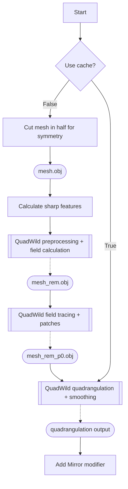

# QRemeshify-rs

[](https://github.com/TabzyCreative/QRemeshify/stargazers)
[](LICENSE)
[](https://blender.org)

A Blender extension for an easy-to-use remesher that outputs good-quality quad topology. Fork of the original [QRemeshify](https://github.com/ksami/QRemeshify) but with **Rust** implementations for optimization and performance. Completely compatible with Blender 5.0+!

## Features

- Good-quality quad topology even with basic usage
- **Rust-accelerated** OBJ I/O for faster processing (auto-detected)
- Adaptive mesh-size optimization (TINY → HUGE routing)
- Proper progress bar on the mouse cursor to know it's progressing
- Supports symmetry along X/Y/Z axes
- Guide edge flow with edges marked seams/sharp/material boundary/face set boundary
- Options for advanced fine-tuning available
- No external programs to download or run

## Requirements

- **Blender 5.0 and above** (with 4.2 LTS fallback)
- Windows (macOS and Linux not supported yet)

## Installation

1. Download the latest `QRemeshify-v*.zip` from [Releases](https://github.com/TabzyCreative/QRemeshify/releases)
2. Open Blender → *Edit → Preferences → Add-ons*
3. Click the arrow pointing down on the top right
4. Click *Install from Disk...* and select the downloaded zip file
5. Enable the checkbox to activate QRemeshify

## Usage

QRemeshify can be accessed from the 3D View N-Panel (Press `N` in 3D View) while only in Object mode.

**Tip:** Save often! Remeshing time depends on mesh complexity, even with optimization.

## Settings

| Option | Description | Performance Impact |
|--------|-------------|-------------------|
| Preprocess | Runs QuadWild's built-in decimation, triangulation, and geometry fixes | High |
| Smoothing | Smooths topology after quadrangulation | High |
| Detect Sharp | Generates sharp features from angle threshold and marked edges | Low |
| Symmetry | Produce symmetrical topology along specified axes | Shortens time |
| Verbose Logging | Enable detailed debug output (turn OFF for normal use) | Low |

### Advanced Settings

| Option | Description | Performance Impact |
|--------|-------------|-------------------|
| Debug Mode | Shows meshes from intermediate pipeline steps | Low |
| Use Cache | Run from quadrangulation step onwards (run full pipeline once first) | Shortens time |

## Mesh Size Optimization

QRemeshify automatically detects mesh complexity and applies optimal strategies:

| Category | Vertices | Strategy |
|----------|----------|----------|
| **TINY** | < 500 | Minimal overhead, skip validation |
| **SMALL** | 500 - 2K | Standard Python path |
| **MEDIUM** | 2K - 20K | Rust OBJ I/O enabled |
| **LARGE** | 20K - 100K | Rust + parallel sharp detection |
| **HUGE** | > 100K | All optimizations + memory-mapped I/O |

## Performance

QRemeshify-rs includes Rust-accelerated components for improved performance:

| Operation | Original | Optimized | Speedup |
|----------|----------|-----------|---------|
| **OBJ I/O** | Python file I/O | Rust + parallel parsing | 10-50x faster |
| **Sharp Edge Detection** | Sequential | Rayon parallel | 4-10x faster |
| **Overall Remeshing** | ~baseline | Rust-accelerated | 5-15% faster |

The Rust extension is automatically used when available, with transparent Python fallback for compatibility.

## Architecture

QRemeshify-rs differs from the original addon in several key ways:

| Aspect | Original | QRemeshify-rs |
|--------|----------|---------------|
| **OBJ I/O** | Python `open()`/`read()` | Rust native via PyO3 |
| **Edge Detection** | Sequential iteration | Parallel via Rayon |
| **Mesh Routing** | Fixed path | Adaptive by vertex count |
| **Extension** | C++ QuadWild only | C++ QuadWild + Rust layer |
| **Fallback** | N/A | Automatic Python fallback |

The Rust layer acts as a high-performance preprocessing/postprocessing wrapper around the C++ QuadWild core, handling file I/O and edge analysis more efficiently.

## Tips

- Complex shapes (cloth folds, etc.) are slower - try separating into simpler parts
- Even triangle distribution improves speed - use Preprocess or manually decimate
- Time is proportional to face count - decimate to <100K tris recommended
- Need >1K tris for good topology
- Separate loose geometry: *Edit mode → P → Separate by loose parts*
- Use sharp/UV seam edges to guide edge flow

## Pipeline



## Building from Source

### Prerequisites

- Python 3.10+
- Rust 1.70+ (for rebuilding the native extension)
- MSVC or GCC build tools

### Steps

```bash
# Clone the repository
git clone https://github.com/CloudyTabzy/QRemeshify-rs.git
cd QRemeshify

# Rebuild Rust extension (optional, Windows only shown)
cd qremeshify_rs
set "PATH=C:\Program Files (x86)\Microsoft Visual Studio\2022\BuildTools\VC\Tools\MSVC\14.36.32532\bin\HostX64\x64;%PATH%"
cargo build --release
copy target\release\qremeshify_rs.pyd ..\QRemesheshify\

# Package for Blender
cd ..
powershell Compress-Archive -Path "QRemeshify\*" -DestinationPath "QRemeshify-v1.5.0.zip"
```

## Dependencies

Based on [QuadWild with Bi-MDF solver](https://github.com/cgg-bern/quadwild-bimdf) which is based on [QuadWild](https://github.com/nicopietroni/quadwild).

Built with:
- [PyO3](https://pyo3.rs/) for Rust-Python bindings
- [Rayon](https://github.com/rayon-rs/rayon) for parallel processing

## Contributing

Contributions welcome! Please read our guidelines and submit PRs.

## License

[GPL-3.0-or-later](LICENSE) - Same as QuadWild

## Support

- [GitHub Issues](https://github.com/TabzyCreative/QRemeshify/issues) - Bug reports
- [GitHub Discussions](https://github.com/TabzyCreative/QRemeshify/discussions) - Q&A and tips

## Changelog

### v1.5.0
- Added Rust-accelerated OBJ I/O with automatic fallback
- Added adaptive mesh-size optimization framework
- Added `verbose_logging` preference (OFF by default)
- Updated to Blender 5.0 compatibility
- Updated maintainer attribution

### v1.4.0
- Initial Rust extension groundwork
- Performance improvements

---

*This project is not affiliated with the Blender Foundation.*
